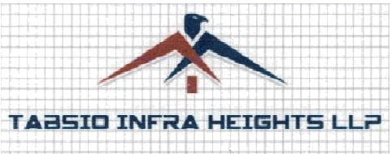

  

<h1 align="center">TABSIO INFRAHEIGHTS LLP</h1>
<h3 align="center">STAR FLYASH BRICK PRODUCT</h3>

---

## Table of Contents
1. [About](#about)  
2. [Mission](#mission)  
3. [Products & Services](#products--services)  
4. [Why Choose Us](#why-choose-us)  
5. [Quality & Sustainability](#quality--sustainability)  
6. [Legal & Company Details](#legal--company-details)  
7. [Contact](#contact)  
8. [License](#license)

---

## About
TABSIO INFRAHEIGHTS LLP is a leader in infrastructure development and building-materials manufacturing. We combine state-of-the-art production techniques with sustainable practices to deliver high-performance materials for residential, commercial, and industrial projects.

---

## Mission
- Deliver premium-quality building materials that meet international standards.  
- Promote eco-friendly and sustainable construction practices.  
- Provide innovative, reliable infrastructure solutions tailored to our clients’ needs.

---

## Products & Services
- **Bricks & Blocks** — High compressive strength, uniform shape, dimensional accuracy.  
- **Custom Construction Solutions** — Project-based services for planning, supply, and logistics.  
- **Consultation & Support** — Technical assistance for material selection and implementation.

---

## Why Choose Us
- **Quality Assurance:** Rigorous QC at every stage of production.  
- **Innovation:** Continuous improvement using modern manufacturing technology.  
- **Sustainability:** Processes and materials chosen to reduce environmental impact.  
- **Customer-Centric:** Transparent communication and collaborative project support.

---

## Quality & Sustainability
TABSIO INFRAHEIGHTS LLP implements strict quality control protocols and invests in efficient manufacturing to reduce waste, energy use, and carbon footprint. Wherever possible, recycled or low-impact raw materials are prioritized.

---

## Legal & Company Details
- Registered as a Limited Liability Partnership under the LLP Act, 2008.  
- Total obligation of contribution: **₹75,00,000**.  
- GST NO. – 10AAJFT6984H1ZW

---

## Contact
**General inquiries:** tabsioinfraheightsllp@gmail.com  
**Phone:** +91-7091688128  
**Address:** A 401 Expression Exotion, Gola Road, Danapur, Patna, Bihar 801508  

---

## License
This repository/document is provided for informational and marketing use. © TABSIO INFRAHEIGHTS LLP. All rights reserved.
